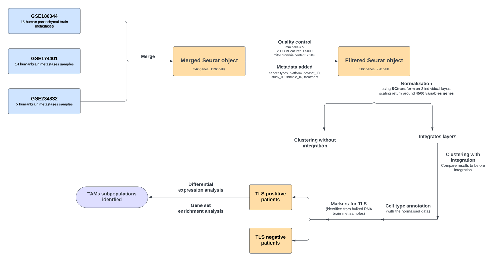
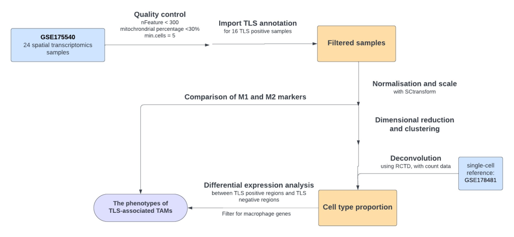
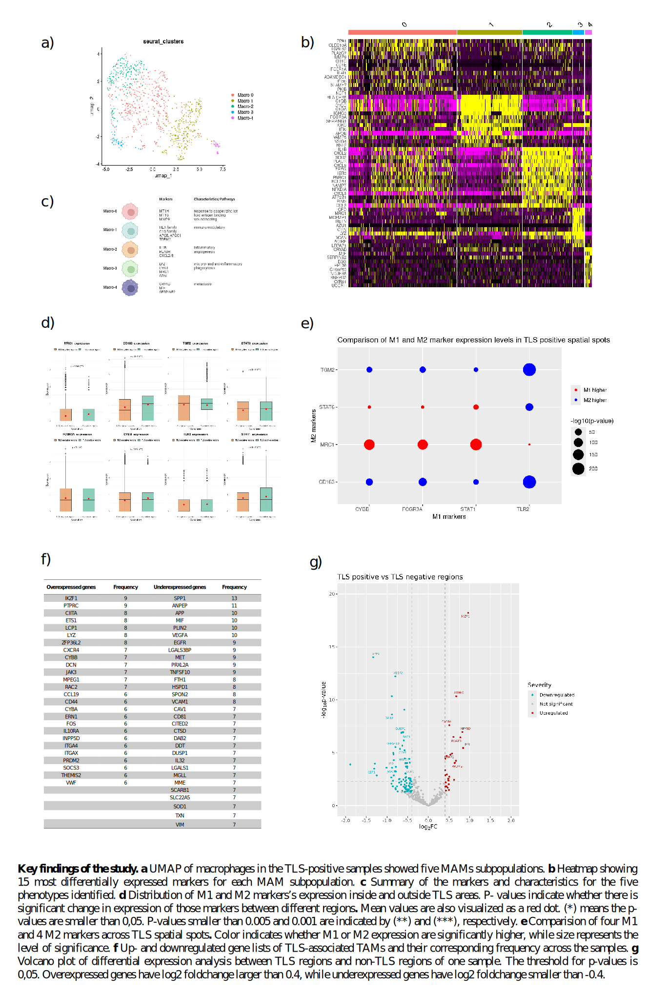

# Single cell and spatial transcriptomics reveal phenotypes of TLS-associated macrophages

## 📌 Overview
Recent years have seen an increasing interest in tertiary lymphoid structures (TLS) as **potential biomarkers** for predicting responses to immunotherapy. However, there is **limited
understanding** of the phenotypes of **tumor-associated macrophages (TAMs)** populations within TLS, even though they play an important role in the induction and development of TLS. Thus 
this study aims to fill this knowledge gap by utilizing single-cell and spatial technology. 

## 🧬 Data
**Single-cell transcriptomics data:** publicly available datasets from Gene Expression Omnibus (GSE186344, GSE174401, GSE234832). They are brain metastasis samples from different primary tumor sites.
**Spatial transcriptomics data:** GSE175540 contains 24 spatial transcriptomics samples from clear cell renal cell carcinoma tissues (ccRCC).

## ⚙️ Methods and Workflow 
- **Single-cell analysis:** Integration of single-cell datasets, cell type annotation, classfication of TLS samples, differential expression analysis and gene set enrichment analysis 
 
- **Spatial analysis:** Deconvolution using RCTD, differential expression analysis using C-SIDE, cell-cell communication using LIANA 
         

## 📈 Results
- TLS-positive samples from single-cell data revealed **five distinct subpopulations** of TAMs.
- Expression levels of classical M1 and M2 macrophage markers were compared, which demonstrated that TLS-associated TAMs exhibit **a mixed M1 and M2 phenotype**.
- TLS-associated TAMs display an **anti-tumor state**, characterized by a significant downregulation of genes involved in metastasis, tumor progression, and angiogenesis. At the
same time, phagocytic activity is increased.
- Lastly, through studying ligand-receptor interactions,**active recruitment** and **migration** of immune cells in TLS regions are observed.
 
  

